# 安装Pycharm
## 安装方法参考 https://www.bilibili.com/opus/931261017038520321

## 文章中提到的安装包
pycharm: 官网下载 https://download-cdn.jetbrains.com/python/pycharm-professional-2024.3.4.exe (diana：亲测此版可正常激活)

jetbra.zip： 网盘下载: https://pan.baidu.com/s/1aTPdlkqpVg93Wpo8GvHHUg?pwd=ixbx 提取码: ixbx

# 安装方法全文
## （2024最新）Pycharm破解激活2099年激活码教程（含win+mac）
忘忧草2025

编辑于 2024年05月14日 13:24
本文讲的是2024最新Pycharm Jetbrains全家桶永久pojie激活教程。jetbrains全家桶软件均可使用此方法激活。

目前安哥已实现激活到2099年，之前的激活到2025过期的，可以替换此文章的激活工具和激活码。

本文讲windows+mac（liunx、centos、Ubuntu）系统激活，先讲windows，再讲mac，这里以Pycharm为例，因为此方式适用下方所有全家桶激活。

### windows激活Pycharm

1.先去IDE官方下载你需要的软件，这里以Pycharm为例，因为此方式适用于所有全家桶激活。这里以最新版2023.3.4为例，此方式适用于所有版本，并支持新版。

官方地址下载Pycharm：https://www.jetbrains.com/Pycharm/download/?section=windows

2.下载下来后正常安装

3.勾选这几个就可以了

4.勾选运行，点击完成

5.打开Pycharm后，先退出，开始激活

6.获取激活工具+激活码，如图

网盘地址： https://pan.baidu.com/s/1XI-kRoKnOI_6imJrW9s2Pw?pwd=ga0d

7.下载下来后，名字是jetbra

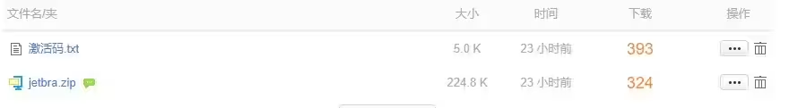

8.记得先解压jetbra.zip，打开scripts目录 

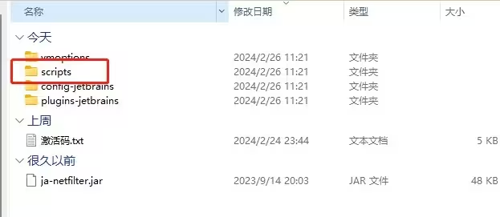

9.双击运行install-all-user.vbs

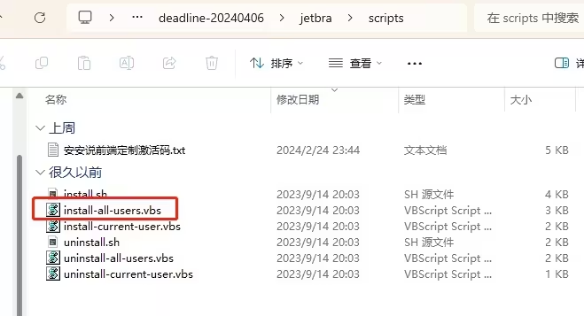

10.点击确定，然后等他弹第二个框，第一次运行时间会比较久，耐心等待

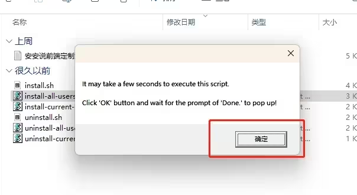

11.出现这个done，说明成功，如果5分钟还没出，重新再点下install-all-user.vbs

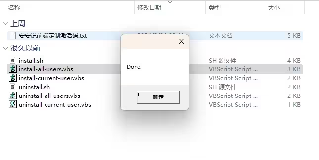

12.打开Pycharm，激活码放在一起的，全选复制粘贴，输入激活码即可

13.激活成功

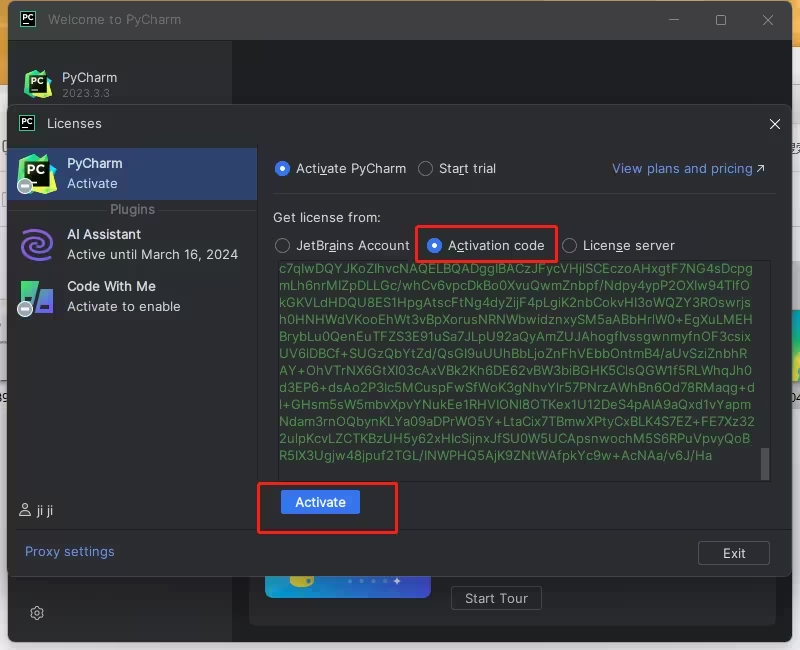

14.实现2099

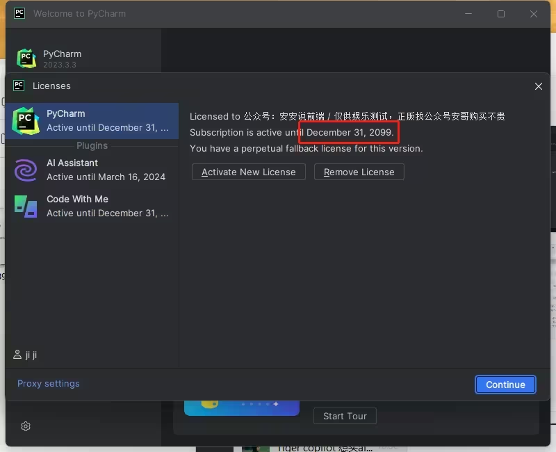

### mac、linux等激活Pycharm

1.先去IDE官方下载你需要的软件，这里以Pycharm为例，因为此方式适用于所有全家桶激活。这里以最新版2023.3.4为例，此方式适用于所有版本，并支持新版。
官方地址下载Pycharm：https://www.jetbrains.com/Pycharm/download/?section=mac

2.下载Pycharm，下来后，运行Pycharm

3.关闭Pycharm，开始激活

4.获取激活工具+激活码

5.解压jetbra

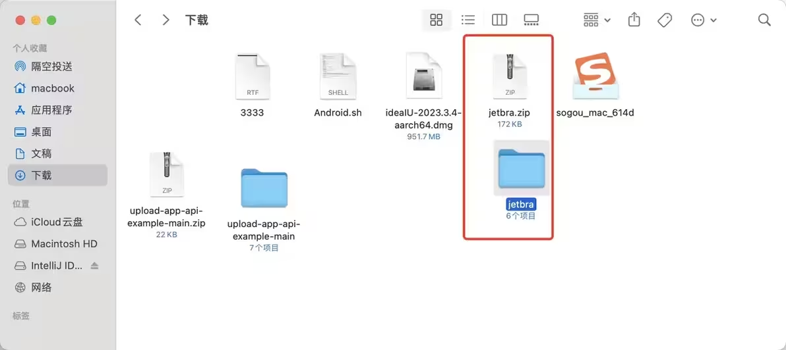

6.打开scripts目录

7.为了方便，点击 显示》》》显示路径栏

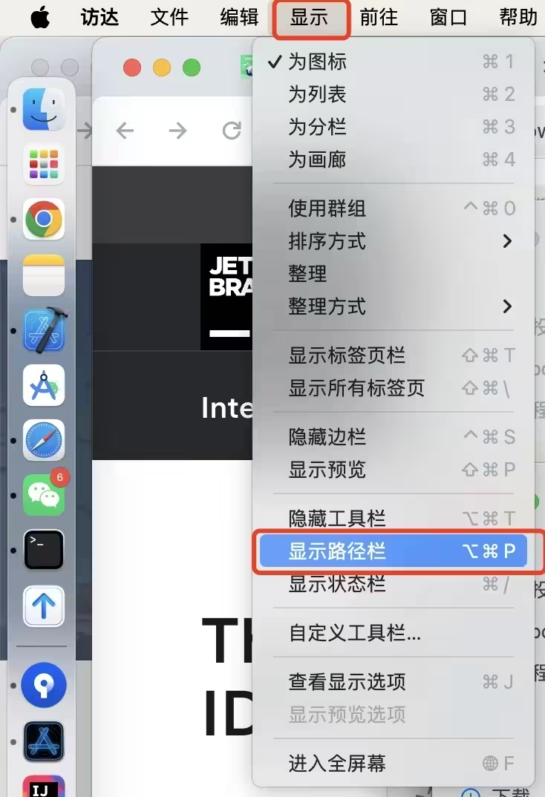

8.下方路径，右键scripts目录，弹开框，点击在终端打开

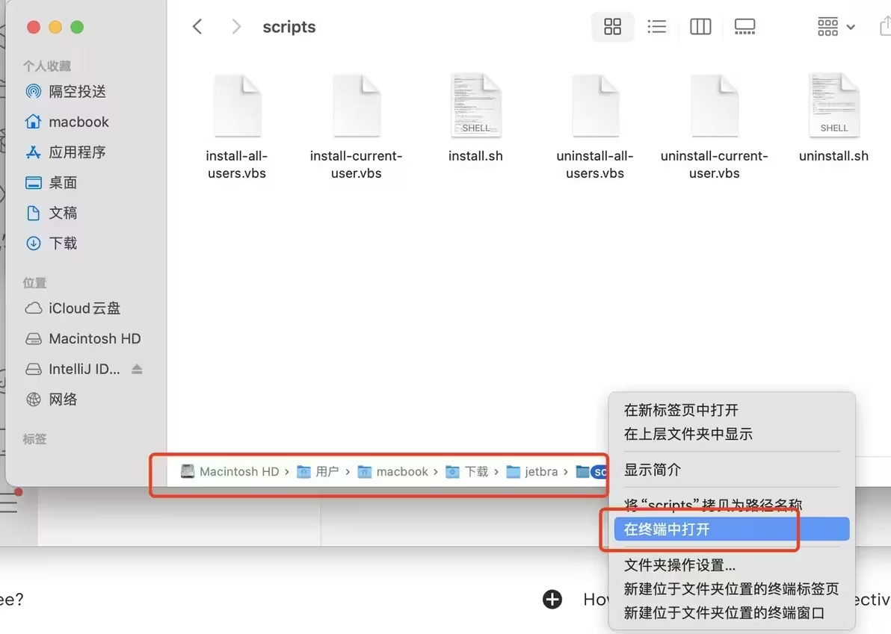

9.运行命令 sudo bash install.sh

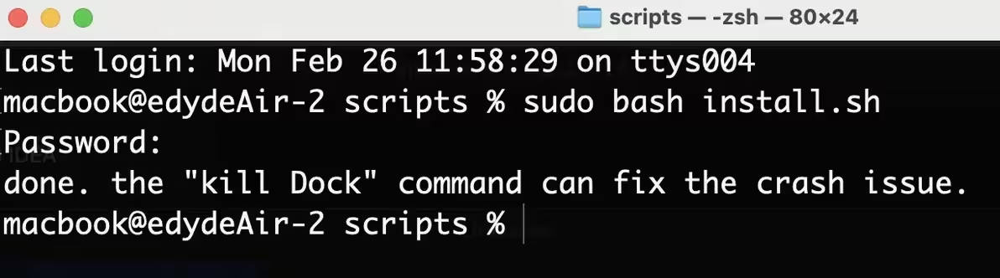

10.再打开Pycharm，激活码放在一起的，全选复制粘贴，输入激活码

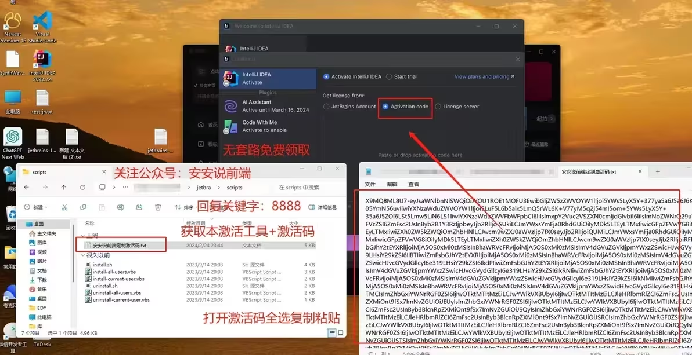

11.激活成功，2099年

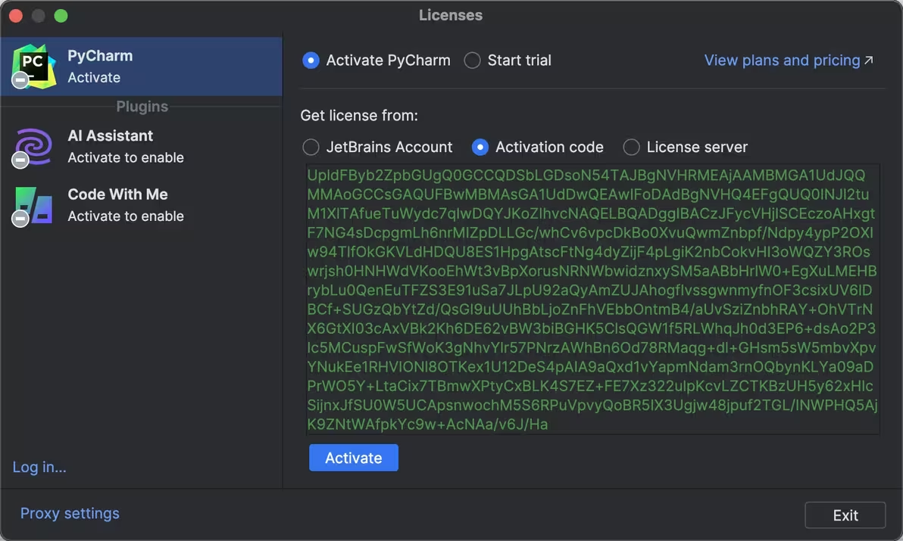

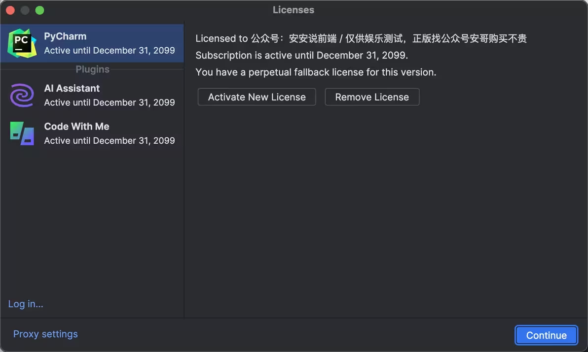

